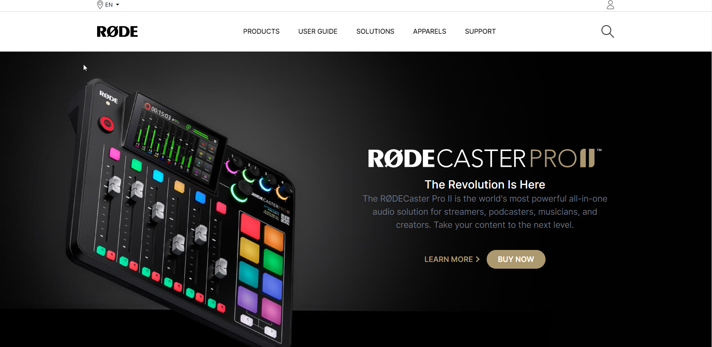
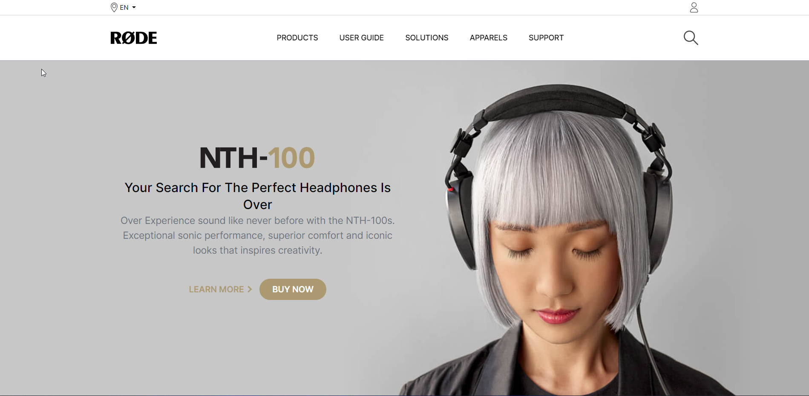
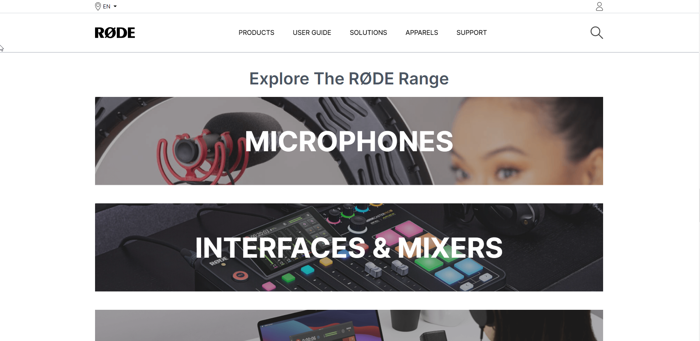
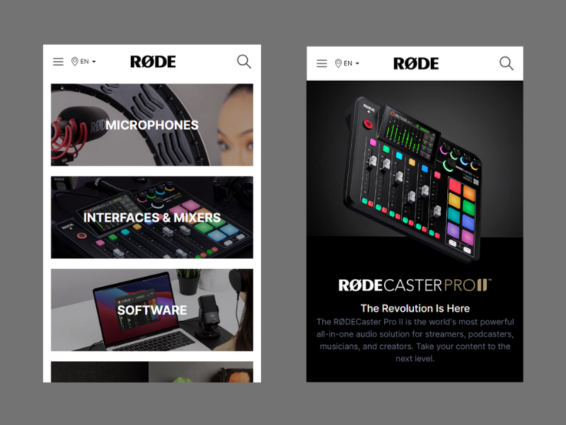

# Design clone of rodes.com home page.

Fully Mobile responsive.

Made using HTML and Tailwind CSS.

### Things I learnt
- Position utility classes in Tailwind
- Hover effects
- Sticky Navbar in Tailwind
- Responsiveness in Tailwind

### Check it out live👉 [here](https://rode-sound.netlify.app//)
-----
## This is how it looks 👀

